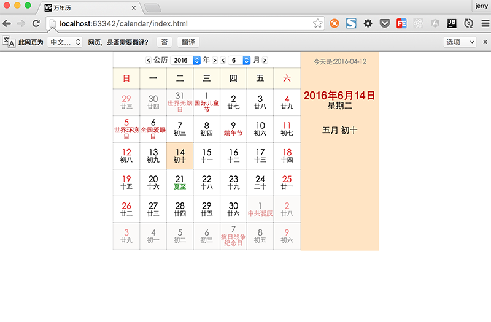
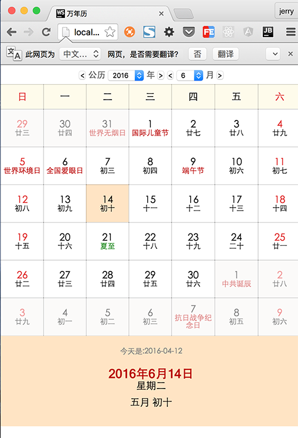
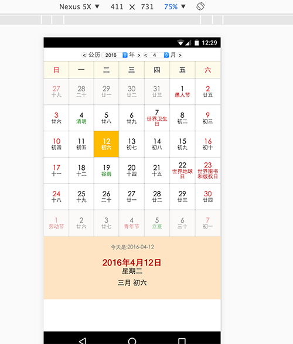

# 万年历 demo

## 功能实现
+ 公历,农历对应
+ 节假日
+ 上下月切换(3种方式:移动端侧滑,按钮,点击非本月日期)
+ 一天详细情况
+ 24节气
+ 响应式布局

## 效果图

###  PC 端



### PC 端响应布局


### 移动端布局



## 实现思路
### 兼容性
兼容性处理的脚本是 `Util.js`
该脚本执行结束后会 `window` 对象上挂载一个全局对象 `Util`
    
#### 代码
```javascript
function Util = (function(){

//省略函数定义

return {
            isContainClassName:...,//是否包含类名
            getEventTarget:...,//获取事件对象
            addClassName:...,//添加类名
            removeClassName:...,//去除类名
            addEventHandler: ...,//添加事件监听
            removeEventHandler: ...,//去除事件监听
            queryDom: ...//DOM 搜索
        };

})();//通过立即执行函数返回对象

window.Util = Util;挂载对象

```

    

### 获取数据
构建数据的脚本是 `calendar.js`
该脚本执行完成以后会在 `window` 对象上挂载一个全局对象 `calendar`


#### 代码
```javascript
//省略函数定义
    var calendar = {
        getMonthDays: ...//传入 年份,月份,返回该月(上下)的
        getLunarDate: ...,//传入日期对象,返回该日期对应的农历对象
        getSolarDay: ...,//传入日期对象,返回该日期对象的公历对象
        dateToString: ...,//传入日期对象,返回该日期对象的 "yyyy-MM-dd"的表示
        getDateNearBy: ...//传入日期对象,和间隔天数(可正可负),返回间隔的日期对象
        getCompleteDay: ...//传入日期对象,返回该日期的所有信息
    };
    //导出 calendar对象
    window.calendar = calendar;

```

#### 代码分析

##### getLunarDate
入参:日期对象
返回:农历日期对象

+ 以公历 `1900/1/31(农历 1900 年正月初一)`为基础年
+ 通过传入日期算出偏移的天数,从1900年开始逐年减去农历年天数,找出农历年
+ 同理再通过将偏移量递减农历月份天数找出月份(闰月回退)
+ 最后剩下的偏移量即可算出农历天
+ 闰月是通过函数 `getLeapMonth` ,通过传入年份,利用 `lunarInfo` 位运算提取闰月信息
+ 农历月名称和农历天通过数组对应下表返回
+ 节日通过字典对象映射


```
{
       year: ....,//农历年
       month: ....,//农历月
       day: ...,
       isLeap: ....,//是否闰月
       monthName: ....,//农历月名称
       dayName: ....,//农历
       festival: ....//农历节日
}
```


##### getTerm
+ 获取某年第几个节气为对应的 day 天
+ 以基准 1890 小寒,公转周期乘以年数+节气偏移时间,计算出该节气对应的日期


##### getYearTerm
+ 获取某公历年中所有的二四节气
+ `key`是月日对应的 `MMdd` 格式,`value` 是该日期对应的节气

##### getSolarDay

+ 获取节气:通过 `getYearTerm` ,获取一年的的节气字典对象,通过字典对象获取该天节气,没有就是 `undefined`
+ 公历节日:通过字典对象返回


```
{
            year: ...,
            month: ....,
            day: ....,
            term: ...,
            date: ...,//公历日期
            festival: ....//公历假日
 }
```

##### getCompleteDay
通过传入日期对象,调用 `getSolarDay` 和 `getLunarDate` 方法整合为一个对象返回

```
{
                    date: ...,//日期对象
                    dateStr: ...,
                    year: ...,//公历
                    month: ...,
                    day: ...,
                    lunarYear: ...,//农历
                    lunarMonth: ...,
                    lunarDay: ...,
                    lunarMonthName: ...,//农历月份名称
                    lunarDayName: ...,//农历天名称
                    isLeapMonth: ...,//是否闰月
                    term: ...,//节气
                    solarFestival: ...,//公历节日
                    lunarFestival: ...,//农历节日
                    isToday: ...,//是否是今天,
                    weekDay: ...//周几

}

```

##### getMonthDays

+ 传入年份,月份,返回该月的所有的数据
+先获取这个月的全部数据,根据第一天是周几,补满上个月的日期,根据数据长度补满下个月的数据 


```
{
    currentMonth:....,
    animal:.....,//生肖
    data:[.....],//42个详细日期对象
    
}
```

### 渲染
`index.js` 文件的脚本

#### 布局
+ 初始化布局时构建 `table` ,并将 `42` 个 `td` dom 的引用加入缓存数组
+ 布局样式通过动态加减类名

#### 数据
+ 调用 `window.calendar` 对象身上的方法获取数据对象,详细数据,根据下表访问缓存DOM数组-即数据对应的渲染 DOM,根据数据增减类名和`innerHTML`达到渲染的效果
+ 每次渲染前要先清除上次的渲染效果
+ 使用事件委托,对每个日期单位的点击事件进行处理,渲染该天的详细情况(右侧)和选中标记


#### 响应式
媒体查询
```
@media screen and (max-width: 520px){}//最大宽度为520px下的css效果
```


#### 移动端
+ 禁止缩放

` <meta name="viewport" content="width=device-width, initial-scale=1, maximum-scale=1, user-scalable=no" />`

#### 侧滑处理

```
slider:{
    isScrolling:...,//是否正在滑动
    startPos:{
        x:...,
        y:...,
        date;...,
    },
    endPos:{
        x:...,
        y:...,
        date;...,
    }
}
```

+ webkit mobile 是有 `touchstart`,`touchmove`,`touchend`三个事件(事件顺序`touchstart`,`touchmove`,`touchend`,`click`)
+ 在 `touchstart` 事件中记录下滑动起点(x,y,time),滑动终点(x,y,time)(初始化一直,防止没有触发`touchmove`),以及
+ `touchmove` 中先调用 `event.preventDefalut()`,阻止默认滑动,并实时记录滑动终点(x,y,time)
+ `touchend` 中,由于通过这个事件对象无法获取离开的坐标,所以要在 `touchmove`中记录,然后根据侧滑的时间间隔(如果太长放弃滑动),滑动距离(如果太短放弃滑动),如果事件间隔在 500ms距离大于 50px,则认为滑动成功,调用 `event.preventDefalut()`阻止点击事件,执行滑动

## 参考

+ [http://blog.jjonline.cn/userInterFace/173.html](http://blog.jjonline.cn/userInterFace/173.html)

+ [http://blog.csdn.net/feniuben/article/details/21159271](http://blog.csdn.net/feniuben/article/details/21159271)

    